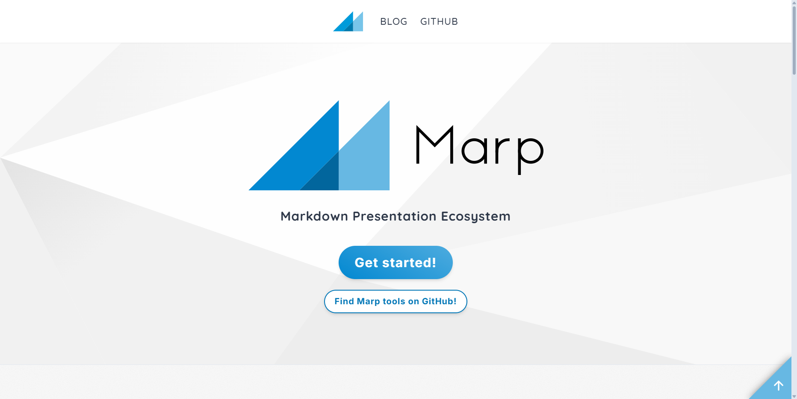
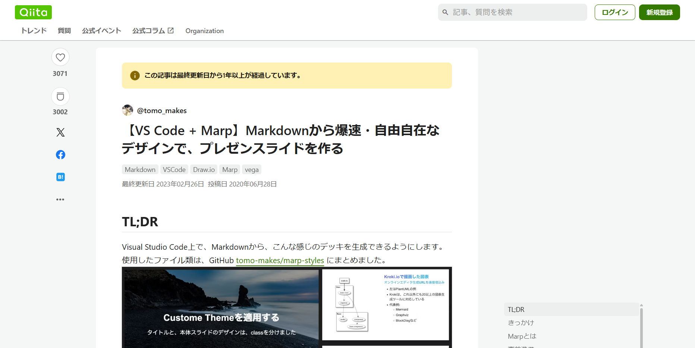

<!-- _class : title -->
# UI/UXはスライドにも宿る
## ❓❓❓

合同会社DMM.com 25新卒FE
平良昂也

---

<!-- _class : title -->
<h2 class=framed style="margin-bottom: 20px; padding:15px 15px; color:#3e5a64;">公開先</h2>

        

---

<!-- _class : content1 -->
# 自己紹介

    

        <h2 style="margin: 0;">平良 昂也</h2>
        
(@__ayanoYuki__)

    

    <ul>
        <li>合同会社DMM.com（2025新卒）
            <ul>
                <li>戦略開発本部 DMMTV開発部 Webアプリケーション開発グループ</li>
            </ul>
        </li>
        <li>趣味
            <ul>
                <li>アニメ、読書、技術</li>
            </ul>
        </li>
    </ul>

---

<!-- _class : content1 -->
# WebアプリにおけるUI/UXの話

- UI(user interface)
  - 
  - ユーザーがWEBアプリを操作する画面
  - フロントエンドが主に担当する領域
- UX(user experience)
  - 
  - ユーザーがWEBアプリの利用を通じて得る体験
  - フロントエンド、バックエンド等の全てが担当する領域

--- 

<!-- _class : content1 -->
# WebアプリにおけるフロントエンドのUI/UXの話

- UI(user interface)
  - 
  - ユーザーが直接触れる「画面」（見た目・操作性に直結する部分）
    - レイアウト、配色、フォント、ボタンやフォームのデザイン
- UX(user experience)
  - 
  - フロントエンドを通してユーザーが「どう感じるか」につながる体験
  - UIを使った結果、快適に目的を達成できるかどうか
    - 体感速度、違和感のない動き、直感的な操作のしさすさ
    - エラーメッセージやバリデーションが分かりやすいか

--- 

<!-- _class : content1 -->
# UI/UXの勉強方法

<h2 class="framed" style="margin-top:20px; margin-bottom:50px;">
  UI/UXは、センスと経験（模倣）で作る
</h2>

- 色んなサービスを使ってみる
- 良いUI/UXを真似して、「なぜ、良いのか」を分析する
- 良いUI/UXを完コピで実装してみる
- 自分だけのUI/UXのメモ帳を作る

---

<!-- _class : content1 -->
# LTは「小さなUI/UXデザイン」

- UI（見た目・操作部分）
  - 
  - スライドのレイアウトや色、フォントサイズ、余白
  - 読みやすいか、見やすいか
  - 情報の「引き算」
- UX（体験・感覚部分）
  - 
  - 聴衆が「理解しやすい」「頭に入りやすい」と感じる体験
  - 情報の流れが自然か、内容が伝わりやすいか
  - 理解度を上げるための「足し算」

---

<!-- _class : title -->
<h1 class=text-underline>スライド作成はハードル低く UI/UXが学べる</h1>

---

<!-- _class : title -->
<h1>
   僕たちはエンジニアですよw
</h1>

---

<!-- _class : title -->
<h1>
   スライドを作るだけでは、 
   技術力が鍛えられないって... 
</h1>

---

<!-- _class : content1 -->
# Marpってツールがありまして...

<h2 class="framed" style="margin-top:20px; margin-bottom:50px;">
  Marpは、 Markdown でスライドを作れるツール
</h2>

- エディタ上だけでスライドを作成できる
- Markdownなので、HTML/CSSが使える
- 類似ツール（Reveal.js、Slidev、Pandoc）と比べて、学習コストが低い
- プログラムベースなので、生成AIと相性が良い
---

<!-- _class : content1 -->
# HTML/CSS次第でデザインが無限大

<h2 style="width:100%; text-align: center;"> MarpはMarkdownなので、HTML/CSSが使える！ </h2>

| 技術     | 役割・用途                 |
|----------|----------------------------|
| Markdown | 基本的なレイアウトを設定する |
| CSS      | スライドのデザインを設定する |
| HTML     | 細かなレイアウトを設定する |

---

<!-- _class : content1 -->
# HTML/CSSの腕試し・練習に使えそう

デフォルトのテーマ＋Markdown onlyでは、デザイン・レイアウトに限界がある

    

        
    

    

        
    

---

<!-- _class : content1 -->
# HTML/CSSの腕試し・練習に使えそう

<svg class="github-mark" viewBox="0 0 1024 1024" width="100%" height="100%">
  <circle cx="512" cy="512" r="500" fill="currentColor" />
  <path class="cat" d="M512 200c-174 0-316 142-316 316 0 140 91 258 217 300 16 3 22-7 22-16 0-8 0-29-1-57-88 19-107-42-107-42-14-35-34-45-34-45-28-19 2-19 2-19 31 2 47 32 47 32 27 47 72 34 90 26 3-20 11-34 20-42-70-8-143-35-143-155 0-34 12-61 32-83-3-8-14-40 3-83 0 0 27-9 88 32 26-7 54-11 82-11s56 4 82 11c61-41 88-32 88-32 17 43 6 75 3 83 20 22 32 49 32 83 0 120-73 147-143 155 11 9 21 27 21 55 0 40-1 72-1 82 0 9 6 19 22 16 126-42 217-160 217-300 0-174-142-316-316-316z" />
</svg>

---

<!-- _class : content1 -->
# おすすめのMarpの学習サイト

    

        
        
    

    

        
        
    

    

        
        
    

---

<!-- _class : content1 -->
# まとめ & Tips

- UI/UXは、センスと経験（模倣）で作る
- スライド制作 = 小さなUI/UXデザイン
  - レイアウト・余白（UI）、理解の流れや体験（UX）
  - つまり発表準備そのものがUI/UX練習の場になる
- Marpで学べること
  - Markdownで気軽に作れる
  - HTML/CSSの練習になる

<h2 class="framed" style="margin-top:20px; margin-bottom:50px;">
  UI/UXの勉強の第一歩に、Marpはいかがでしょうか？
</h2>

---

    

---

<!-- _class : title -->
<h2 class=framed style="margin-bottom: 20px; padding:15px 15px; color:#3e5a64;">おまけ</h2>

# 「UIは引き算で、UXは足し算」と言われる理由を考えてみた
  

---

<!-- _class : content1 -->

# おまけ：UIは「引き算」と言われる理由
- 人間の認知負荷（認知心理学）
  - 人は一度に処理できる情報量が限られています（Millerの法則：7±2など）
  - 余計なボタンやメニューがあると、ユーザーは迷い、操作性が下がる
- ミニマリズム的な設計思想
  - UIは「ユーザーとシステムの接点」なので、目的達成に直接関係しない要素を排除するのが基本
  - 余計な色、装飾、機能を削ることで直感的に使えるインターフェースになる。

<!-- つまりUIの本質は「ノイズを減らすこと」＝引き算 -->

---

<!-- _class : content1 -->

# おまけ：UXは「足し算」と言われる理由
- 体験は積み重なる（サービスデザイン）
  - UXは単なる見た目や操作性ではなく、購入前から利用後までの体験全体を扱う
  - 例えば「便利さ」＋「安心感」＋「楽しさ」が合わさって「良いUX」になる
- 感情価値の付加（行動経済学・感性工学）
  - 人は機能的価値だけでは満足せず、情緒的価値（ワクワク感、信頼感、楽しさ）を積み重ねることでポジティブな体験が形成される
- UXは線形でなく複合的
  - ちょっと便利、ちょっと安心、ちょっと楽しい → それらの総和（場合によっては相乗効果）がUXの良し悪しを決める

<!-- つまりUXの本質は「価値を積み上げること」＝足し算 -->
